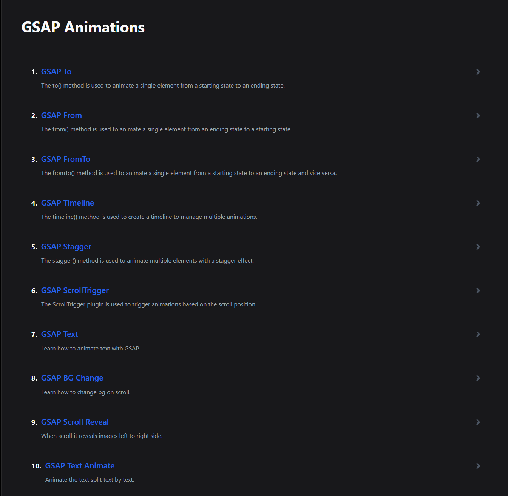

<div align="center">
    <a href="https://gsap-crash-course.vercel.app" target="_blank">
      
    </a>
  <h3 align="center">GSAP Workshop (Starter)</h3>
</div>

##  <br /> 📋 <a name="table">Table of Contents</a>

- ✨ [Introduction](#introduction)
- ⚙️ [Tech Stack](#tech-stack)
- 🚀 [Quick Start](#quick-start)


##  <br /> <a name="introduction">✨ Introduction</a>

Simple GSAP workshop showcasing various primary animations. GSAP (GreenSock Animation Platform) is a framework-agnostic JavaScript animation library used to create fluid and engaging animations.


##  <br /> <a name="tech-stack">⚙️ Tech Stack</a>

1. ReactJS
2. GSAP
3. Tailwind CSS


## <br /> <a name="quick-start">🚀 Quick Start</a>


Follow these steps to set up the project locally on your machine.


<br/>**Prerequisites**

1. Clone the repository or download zip file.
2. Extract it. 
3. Download the necessary files by using command npm i.

```bash
npm install
```
4. npm run dev : to run program.
